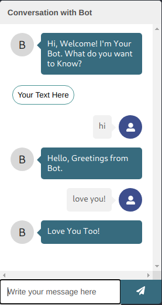

# Automated Static Chat Bot Built using React chat-bot-kit package

> **Prereqisites:**
* As the Project is completely built on `react`, `nodejs` is mandatory to run the project.
* You can see how to install node [here](https://www.nodejs.org)
* Install NPM if not installed while installing node
# Running and Testing Locally
* Clone my repository or Download the zip File
* In your Terminal run the following commands
* npm install
* npm start to start your server
# Making Your Own Changes
* To Generate more Widget items add them in [AdmissionInfo.js](src/components/AdmissionInfo/AdmissionInfo.js)
* Define Your Widgets in [config.js](src/config.js)
* Add Function Definition to handle widgets in [ActionProvider.js](src/ActionProvider.js)
* Add Cases to handle input text in [MessageParser.js](src/MessageParser.js) and give call to the functions defined in
ActionProvider.js
# Deployment
* Create an account for Deployment Severs like [vercel](https://www.vercel.com) or [heroku](https://www.heroku.com) and deploy
* I Recommend Vercel
* run command vercel --public to upload from your terminal
# Deploying on Cloud(Ex:AWS)
* Clone my repository or Download the zip File to your /var/www/html folder.
* In your Terminal run the following commands
* npm install
* npm start to start your server and run "npm build" to deploy project on the server
